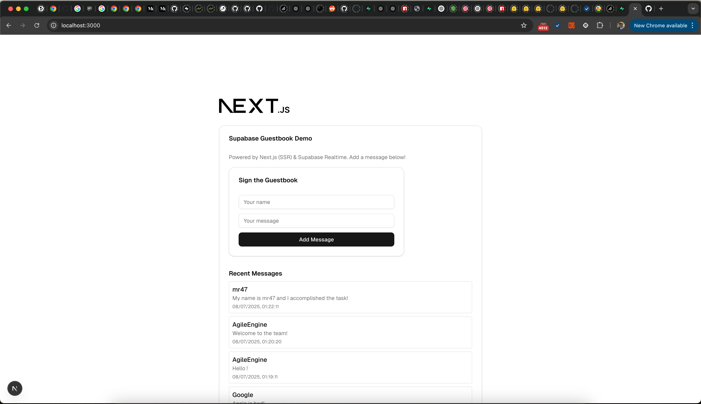

# Next.js + Supabase + Drizzle ORM + shadcn/ui Demo



A modern full-stack demo app showcasing:

- **Next.js** (App Router, SSR/CSR, API routes)
- **Supabase** (Postgres, Auth, Realtime)
- **Drizzle ORM** (typed schema, migrations)
- **shadcn/ui** (beautiful React UI components)

## Features
- Guestbook with live-updating messages using Supabase Realtime
- Typed database schema and migrations with Drizzle ORM
- Modern, accessible UI with shadcn/ui
- Fully typed, scalable, and ready for production

## Stack Overview
- **Frontend:** Next.js, React 19, shadcn/ui, Tailwind CSS
- **Backend:** Supabase (Postgres, Realtime), Drizzle ORM
- **ORM & Migrations:** Drizzle ORM + Drizzle Kit

## Getting Started
1. Install dependencies:
   ```bash
   npm install
   ```
2. Set your Supabase Postgres connection string in `.env.local`:
   ```env
   DATABASE_URL=postgresql://postgres:<password>@db.<project>.supabase.co:5432/postgres
   ```
3. Generate and apply migrations:
   ```bash
   npx drizzle-kit generate:pg
   # Apply generated SQL to your Supabase DB
   ```
4. Run the dev server:
   ```bash
   npm run dev
   ```

## Demo Functionality
- Add your name and message to the guestbook.
- See new messages appear in real-time (Supabase Realtime).
- All database schema and migrations are managed with Drizzle ORM.

---

Built for modern full-stack development and rapid prototyping. Enjoy!
